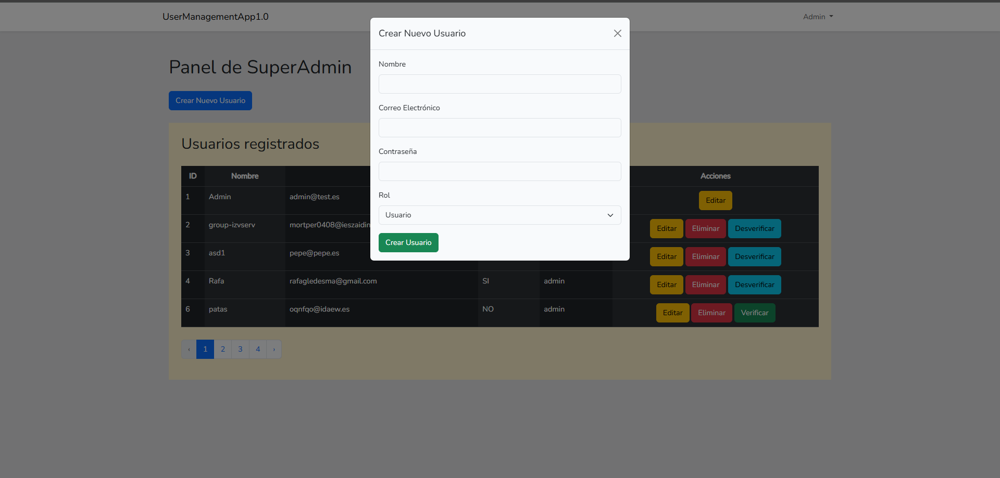

# User Management Application

## Descripción

Esta aplicación ha sido diseñada para optimizar la gestión de usuarios, ofreciendo a los administradores una herramienta robusta y profesional. Con una interfaz intuitiva y moderna, permite realizar acciones clave como la creación, edición, eliminación y verificación de usuarios de manera eficiente. Su enfoque en la usabilidad y la administración avanzada garantiza un flujo de trabajo fluido y productivo.

## Funcionalidades

- **SuperAdmin** : Acesso total

- **Admin** : Borrar, crear, editar usuarios

- **User** : Modificar sus datos

## Imágenes

### 1. Login


### 2. Register


### 3. Panel Super Admin


### 4. Panel del Admin


### 5. Panel User


### 6. Editar Usuario con Modal


### 7. Crear Usuario



## Instalación

1. Clona el repositorio:
    ```sh
    git clone https://github.com/Mariortega83/userManagement
    ```

2. Instala las dependencias:
    ```sh
    composer install
    npm install
    ```

3. Configura el archivo [.env]:
    ```sh
    cp .env.example .env
    php artisan key:generate
    ```

4. Ejecuta las migraciones:
    ```sh
    php artisan migrate
    ```

5. Inicia los assets:
    ```sh
    npm run dev
    ```


